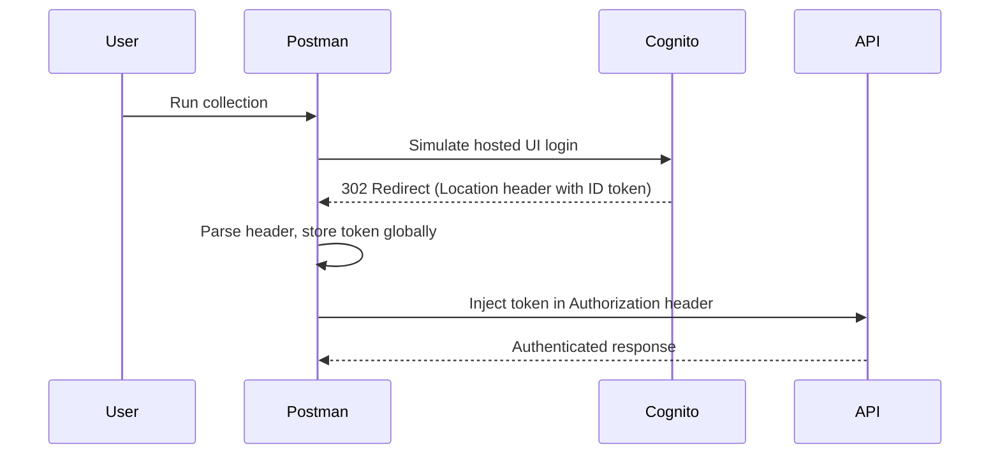

# Automating AWS Cognito Token Retrieval in Postman

A lightweight Postman-based solution that automates AWS Cognito authentication without manual login or SDKs.

---

## 💡 Motivation
AWS Cognito's hosted UI and OAuth2 implicit grant flow normally require users to log in manually through a browser to obtain tokens. This makes automated API testing and CI integration inconvenient for developers building Cognito-protected APIs.

This repository demonstrates how to simulate that flow programmatically inside Postman, extract valid tokens from redirect headers, and automatically refresh them for subsequent API calls.

---

## ⚙️ How It Works
The collection mimics the Cognito hosted login sequence using Postman scripting capabilities:

1. Sends a `POST` request to the Cognito `/login` endpoint, simulating the hosted UI login form.
2. Intercepts the `Location` header in the redirect response, extracting the `id_token` and `access_token` (requires "Automatically follow redirects" to be disabled in Postman settings).
3. Stores the token globally in Postman and timestamps its creation.
4. Checks token expiry before each request and automatically fetches a new one when needed.
5. Injects the valid token into the `Authorization` header for all secured API calls.



> *Note:* Automatic redirect following must be disabled in Postman settings to capture the Location header.

---

## 🧩 Setup

### Requirements
- Postman (v10 or higher)
- AWS Cognito User Pool with Hosted UI enabled
- App client with Implicit grant enabled (required for token extraction from redirects)
- Basic familiarity with environment variables in Postman

### Configuration
1. Import the collection and environment JSON files from the `postman/` directory.
2. Edit the environment variables:
   - `client_id`
   - `redirect_uri`
   - `username`
   - `password`
   - `region`
3. **Important:** Disable "Automatically follow redirects" in Postman settings.
   > This ensures the `/login` response stops at the redirect, allowing the token extraction.
   > **Steps (as of Postman v11.68.5):**
   > - Open Postman.
   > - Go to File > Settings (or press Ctrl + ,).
   > - Select the General tab.
   > - Uncheck the "Automatically follow redirects" option.
   > - Click Save.
4. Run the **Users → Get Token** request to initialize authentication.

---

## 🚀 Usage
- Execute `Users → Get Token` to retrieve and store a new token.
- Run any protected API request (e.g., `Payments → Send Payment`).
- The pre-request script will automatically refresh tokens when expired.

Sample output from Postman console:
```
Getting a new token ...
** ID Token: eyJraWQiOiJ... **
Token is still valid.
```

---

## 🧠 Technical Breakdown
- **Hosted UI /login simulation** — form-encoded POST request with CSRF token.
- **Token extraction** — parses `Location` header from 302 redirect.
- **Global persistence** — stores token and timestamp via `pm.globals`.
- **Auto-refresh logic** — renews tokens when older than 1 hour.
- **Chained execution** — dependent requests reuse updated tokens dynamically.

---

## 🔐 Security Notes
- This method is intended **only for development and testing environments**.
- Do **not** commit real credentials or tokens.
- For production integration, use AWS SDKs or Cognito’s official API flows.

### Why Not Use the InitiateAuth API Instead?
While the `InitiateAuth` API (e.g., with `USER_PASSWORD_AUTH`) is a valid alternative for direct token retrieval, companies often avoid it due to these common practical reasons:
- **Security Policy (Password Handling):** Many organizations prohibit sending raw passwords in API payloads to prevent interception or logging risks. They enforce SRP (Secure Remote Password) or UI-based flows instead.
- **App Client Restrictions:** The Cognito app client must have `ALLOW_USER_PASSWORD_AUTH` enabled. If disabled (common for security), the API fails, and policies may forbid enabling it.
- **IAM Policy Restrictions:** Backend roles are often scoped to exclude auth operations like `InitiateAuth`, limiting access to read-only or specific actions to prevent credential misuse.

If these constraints don't apply, `InitiateAuth` with SRP can be a cleaner option for automation. For reference, an alternative Postman collection using `InitiateAuth` is provided in the `InitiateAuth/` directory.

---

## 📂 Repository Structure
```
postman-cognito-automation/
├── README.md
├── LICENSE
├── assets/
│   ├── flow-diagram.png
│   └── postman-screenshot.png
├── postman/
│   ├── cognito-get-token.postman_collection.json
│   └── cognito-env.postman_environment.json
├── InitiateAuth/
│   ├── postman/
│   │   ├── cognito-initiate-auth.postman_collection.json
│   │   └── cognito-env-initiate-auth.postman_environment.json
│   └── scripts/
│       ├── getTokenInitiateAuth.postresponse.js
│       └── sendPaymentInitiateAuth.prerequest.js
└── scripts/
    ├── getToken.postresponse.js
    └── sendPayment.prerequest.js
```

---

## 📝 License
MIT License © 2025 [Saeed Badran](https://www.linkedin.com/in/sbadran)

---

## 🌍 About
Created by **Saeed Badran**
Senior Backend Engineer | FinTech & Distributed Systems

> Contributions and PRs are welcome!
> If you found this helpful, check out the companion article on Medium: *How I Automated AWS Cognito Token Retrieval in Postman Without the Hosted UI*

